<!-- _class: cover -->
<!-- _paginate: false -->

<div class="tags">
  <span class="tag tag-snowflake">Snowflake</span>
  <span class="tag tag-sp">Stored Procedure</span>
  <span class="tag tag-python">Python</span>
</div>

# ❄️Snowflake Python Stored Procedure

<p class="lead">SQLでPythonを動かす実践ハンズオン</p>

データサイエンティスト fukushiki(X:@fuku4ki)

**作成日:** 2026/05/13
**更新日:** 2026/05/13

---

# このハンズオンについて

**目的**
このハンズオンでは、Snowflakeの**Stored Procedure**を使って、SQLからPythonコードを実行し、
`STAGE → BRONZE → SILVER → GOLD`の流れでデータ変換を実装する方法を学びます。

特に、SILVER/GOLDレイヤーでの前処理・予測処理を通して、SQLとPythonを組み合わせた実践的なパイプライン構築を体験します。

<br>

**このハンズオンを通して学べること**
- SnowflakeでStored Procedureを作成・実行する基本手順
- SQL内でPythonコードを動かす2つの方法（inline / import）
- メダリオンアーキテクチャに沿ったデータ加工フローの実装イメージ

---

# Stored Procedureとは

Snowflakeの**Stored Procedure**は、複数のデータベース操作を自動化し、再利用可能なコードを作成するための強力なツールです。
Stored Procedureでは、複数のプログラム言語をSQL内で記載することができるためより複雑なロジックを簡潔にまとめ、効率的に実行できます。  
このハンズオンでは、その中でも
"<u>PythonをSQLに組み込んで複雑なデータ変換ができる</u>"ところにフォーカスして学習を進めていきます。

<br><br>

<a class="link-card" href="https://docs.snowflake.com/ja/developer-guide/snowflake-cli/index" target="_blank">
  <span class="link-card-icon">📄</span>
  <span>
    <div class="link-card-title">Snowflake - ストアドプロシージャの概要</div>
    <div class="link-card-url">https://docs.snowflake.com/ja/developer-guide/stored-procedure/stored-procedures-overview</div>
  </span>
</a>

---

# ハンズオンの手順全体像

ハンズオンは以下のようなSTEPで実施します。
1. Setup(テーブルの作成・STAGE・BRONZE・SILVER・GOLDレイヤーの作成)
2. CSVデータのロード
3. BRONZEレイヤーへのデータロード
4. SILVERレイヤーへのデータロード(Stored ProcedureによるPythonコードの実行)
5. GOLDレイヤーへのデータロード(Stored ProcedureによるPythonコードの実行)
6. クリーンアップ

---

# データベースのスキーマ構成

Snowflakeテンプレートに合わせたスキーマ定義のメダリオンアーキテクチャ形式を採用しています。(次ページ参照)
ただし、`STAGE`レイヤーは、このハンズオン独自に内部ステージとしてデータやPythonスクリプトを格納するように作成しています。

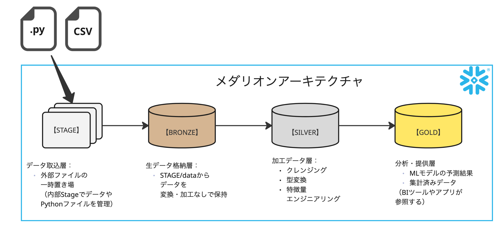


---

# メダリオンアーキテクチャとは

メダリオンアーキテクチャは、データの品質と用途に応じてレイヤーを分けて管理する設計パターンです。
このハンズオンでは、以下の4層で処理を進めます。

- `STAGE`: 取り込みファイルやPythonスクリプトを格納する作業用レイヤー
- `BRONZE`: 生データをそのまま保持するレイヤー
- `SILVER`: 前処理・特徴量作成などの変換を行うレイヤー
- `GOLD`: 分析・可視化・活用向けに整形したレイヤー

このようにレイヤーを分けることで、処理責務が明確になり、再実行・保守・拡張がしやすくなるとして、
広く採用されているアーキテクチャです。

---

<!-- _class: section-break -->

# ハンズオン本編

---

## ハンズオンの実行環境について
**概要**
このハンズオンでは主にSnowflakeのWebUIであるSnowsightを使用して実行します。
`src/snowflake`ディレクトリに記載されているSQLをコピーすれば動くような設定になっています。

また、SQLファイルはSnowsightのWorkspaceに作業用フォルダを作って作業することを推奨しています。


**Snowsight - Workspace**

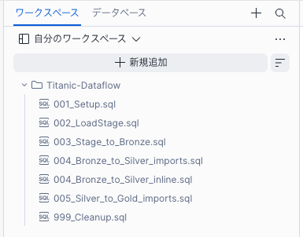


---

## 実行したいデータ加工とスキーマの対応

このハンズオンで実行するデータ加工は、以下のSTEPで各スキーマに対応しています。

1. STEP 1（STAGE）: 
   CSVファイルとPythonファイルを内部ステージ`STG_TITANIC`へ配置する
2. STEP 2（BRONZE）: 
   `RAW_TITANIC`テーブルへ生データをそのままロードする（`COPY INTO`）
3. STEP 3（SILVER）: 
   `RAW_TITANIC`を前処理して`FEATURE_TITANIC`を作成する（欠損補完・エンコード）
4. STEP 4（GOLD）: 
   `FEATURE_TITANIC`を使って予測を実行し`PREDICTION_TITANIC`へ格納する


---

## 実装の全体像

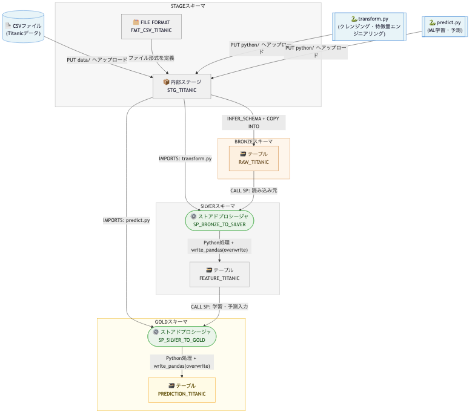

---

## 使用するデータの準備
**データ概要**
このハンズオンではデータ分析プラットフォームKaggleの[yasserh/titanic-dataset](https://www.kaggle.com/datasets/yasserh/titanic-dataset)データセットを利用しています。(License `CC0: Public Domain (CC0-1.0)`)

**DL方法**
ページに飛び、`Download` → `Download dataset as zip`からデータをDLしてきてください。
`Titanic-Dataset.csv`を今回は使います。

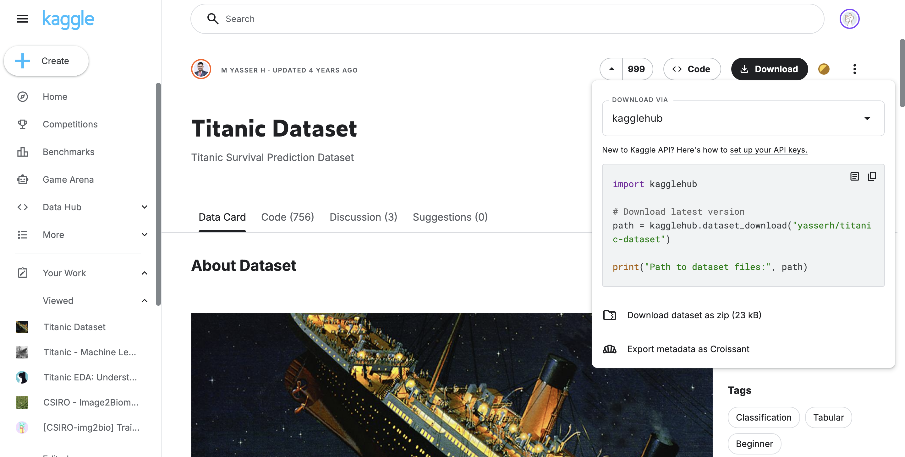

--- 

## 1. Setup

**概要**
このハンズオンで実行するデータベースやスキーマの作成、権限の指定などを行います。

**利用するSQL**
- `001_Setup.sql`


**実装イメージ**


---

**001_Setup.sql - SQL概要**

|STEP|項目|概要|
|---|---|---|
|1|データベースの作成|テンプレートファイルである`PUBLIC_DB_TEMPLATE`を利用してデータベースを作成します。|
|2|スキーマの作成|`STAGE`および、`BRONZE`、`SILVER`、`GOLD`の各レイヤー用のスキーマを作成します。<br>テンプレートには`BRONZE`、`SILVER`、`GOLD`が記載されているので、実際に作成されるのは`STAGE`のみが作成されるかと思います。|
|3|権限の指定|データベース・スキーマにそれぞれ権限を指定しています。|

**データベースエクスプローラの状態**
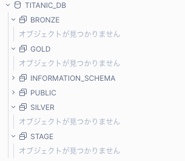

---

## 2. CSVデータのロード
**概要**
Snowflakeの`STAGE`レイヤー(内部STAGE)に今回利用するCSVデータをロードします。

**利用するSQL**
- `002_LoadStage.sql`

**実装イメージ**
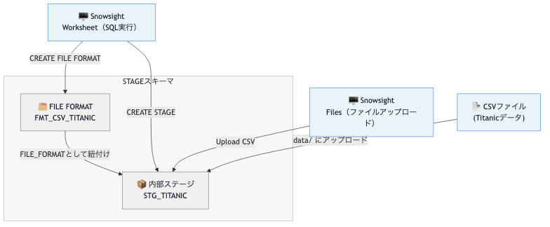

---

### 2-1. SQLによる操作

**002_LoadStage.sql - SQL概要**
|STEP|項目|概要|
|---|---|---|
|1|FILE FORMATの作成|CSVファイルをロードするためのFILE FORMATを作成します。|
|2|内部STAGEの作成|Snowflakeの内部STAGEを作成します。|

<br>
<br>

**データベースエクスプローラの状態 - STAGEレイヤー**
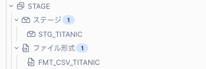

---

### 2-2. ファイルのアップロード(Snowsightでの操作)
**Snowsightで操作**
Snowsightで`カタログ>データベースエクスプローラ>TITANIC_DB>STAGE>STG_TITANIC`の順でクリックし、
`ファイルをアップロード`からCSVファイルをアップロードします。
このとき、オプションのフォルダ指定に`/data`を指定するようにしてください。


**アップロード画面**
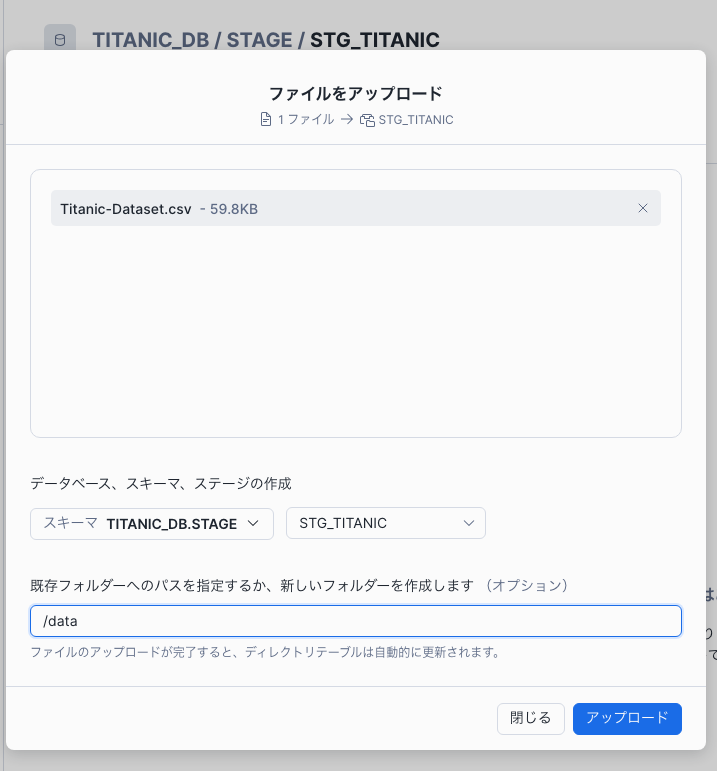

---

## 3. BRONZEレイヤーへのデータロード
**概要**
STAGEレイヤーにアップロードしたCSVデータをBRONZEレイヤーにロードします。ここでは、単純にCSVデータをテーブルにロードするだけの処理を行います。

**利用するSQL**
- `003_Stage_to_Bronze.sql`

**実装イメージ**
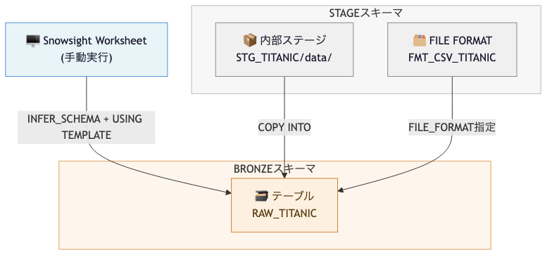

---

### 3-1. SQLによる操作

**003_Stage_to_Bronze.sql - SQL概要**
|STEP|項目|概要|
|---|---|---|
|1|`RAW_TITANIC`の作成|`STAGE`レイヤーにアップロードしたCSVデータを格納するためのテーブルを作成します。<br> この際に、スキーマは`INFER_SCHEMA`を使用して推定しています。|
|2|データのロード|`COPY INTO`コマンドを使用して、`STAGE`レイヤーにアップロードしたCSVデータを`RAW_TITANIC`テーブルにロードします。|

**実行後のデータベースエクスプローラの状態 - Bronzeレイヤー**
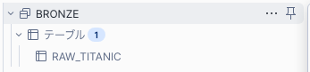

---

## 4. SILVERレイヤーへのデータロード

**概要**
BRONZEレイヤーのデータを加工してSILVERレイヤーにロードします。変換にはPythonを使用するため、Stored Procedureを登録してから実行します。

**利用するSQL**
- `004_Bronze_to_Silver_inline.sql`
- `004_Bronze_to_Silver_import.sql`

**実装イメージ**
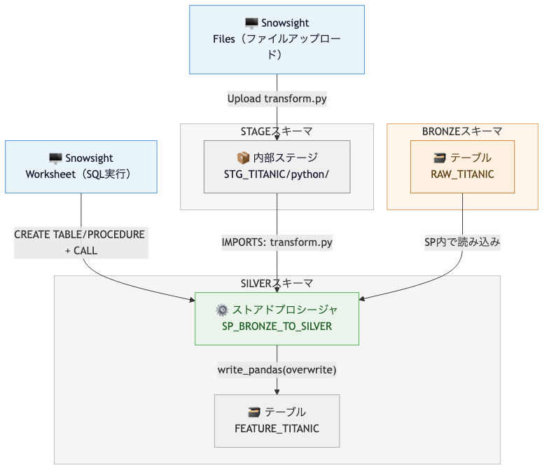

---

## 4-1. Pythonファイルのアップロード(Snowsightでの操作)
**Snowsightで操作**
Snowsight `カタログ>データベースエクスプローラ>TITANIC_DB>STAGE>STG_TITANIC`の順でクリックし、`ファイルをアップロード`からPythonファイルをアップロードします。Pythonのスクリプトファイルは`src/snowflake/python/*`に用意されているものを使用してください。
このとき、オプションのフォルダ指定に`/python`を指定するようにしてください。
また、このタイミングで`transform.py / predict.py`の両方をアップロードするようにしてください。

**アップロード画面**
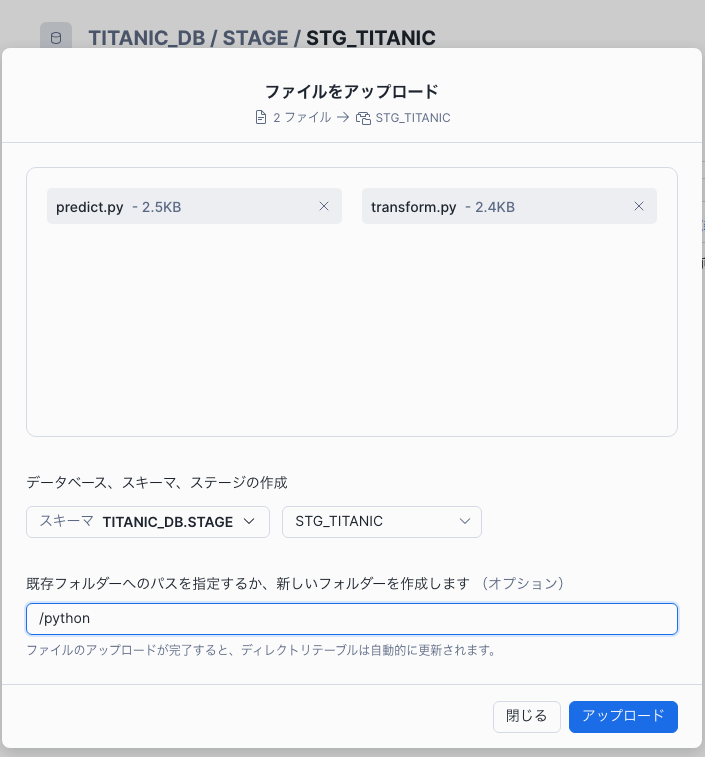

---

## 4-2. SQLによる操作

**004_Bronze_to_Silver_inline.sql & 004_Bronze_to_Silver_import.sql - SQL概要**
どちらを実行しても同様の結果が得られます。

|STEP|項目|概要|
|---|---|---|
|1|`FEATURE_TITANIC`テーブルの作成|`RAW_TITANIC`テーブルのデータを加工して機械学習モデルに投入するための特徴量テーブルを`SILVER`レイヤーに作成します。|
|2|Stored Procedureの作成|**004_Bronze_to_Silver_inline.sql**の場合 : <br> インラインに書かれたpythonコードを使用してStored Procedureを作成します。<br> **004_Bronze_to_Silver_import.sql**の場合 : <br> 外部ファイルとしてアップロードしたPythonコードを使用してStored Procedureを作成します。|
|3|Stored Procedureの実行|作成したStored Procedureを実行して、`FEATURE_TITANIC`テーブルにデータをロードします。|

**実行後のデータベースエクスプローラの状態 - Silverレイヤー**
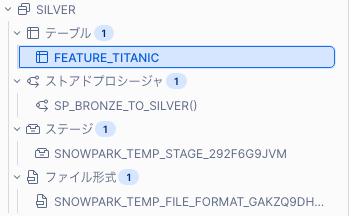

---

## 4-2-1. SQLについての解説 - inline

Stored ProcedureではSQL内に直接Pythonコードを記載することができます。

```sql
CREATE OR REPLACE PROCEDURE TITANIC_DB.SILVER.SP_BRONZE_TO_SILVER()
  RETURNS STRING
  LANGUAGE PYTHON
  RUNTIME_VERSION = '3.11'
  PACKAGES = ('snowflake-snowpark-python', 'pandas')
  HANDLER = 'main'
  EXECUTE AS CALLER
AS $$
import pandas as pd
from snowflake.snowpark import Session
def main(session: Session) -> str:
    df = session.table('TITANIC_DB.BRONZE.RAW_TITANIC').to_pandas() # BRONZEから読み込み
    session.write_pandas( # 省略（前処理・特徴量エンジニアリング）
        df_silver,
        'FEATURE_TITANIC',
        schema='SILVER',
        database='TITANIC_DB',
        overwrite=True
    )
    return f'完了: {len(df_silver)} 件をSILVERに書き込みました'
$$;
-- ストアドプロシージャの実行
CALL TITANIC_DB.SILVER.SP_BRONZE_TO_SILVER();
```

---

## 4-2-2. SQLについての解説 - import

基本はinlineと同じ記載になっていますが、`IMPORTS`オプションを用いて外部ファイルとしてアップロードしたPythonコードを使用しています。

```sql
-- ストアドプロシージャの作成
CREATE OR REPLACE PROCEDURE TITANIC_DB.SILVER.SP_BRONZE_TO_SILVER()
  RETURNS STRING
  LANGUAGE PYTHON
  RUNTIME_VERSION = '3.11'
  PACKAGES = ('snowflake-snowpark-python', 'pandas')
  --- ここで、外部ファイルとしてアップロードしたPythonコードを指定しています
  IMPORTS = ('@TITANIC_DB.STAGE.STG_TITANIC/python/transform.py')
  HANDLER = 'transform.main'
  EXECUTE AS CALLER
AS '';

-- ストアドプロシージャの実行
CALL TITANIC_DB.SILVER.SP_BRONZE_TO_SILVER();
```

---

## 4-3. （参考）特徴量エンジニアリング - transform.py

`transform.py` では、`BRONZE.RAW_TITANIC` から学習用の特徴量を作成して `SILVER.FEATURE_TITANIC` に書き込みます。

|STEP|処理内容|出力カラム例|
|---|---|---|
|1|欠損値補完|`AGE` を中央値で補完、`EMBARKED` を `S` で補完|
|2|カテゴリ変数の数値化|`SEX` を `SEX_ENCODED`（male=1, female=0）へ変換|
|3|One-hotエンコーディング|`EMBARKED` から `EMBARKED_C`, `EMBARKED_Q`, `EMBARKED_S` を作成|
|4|学習用カラムの整形|`PASSENGERID`, `SURVIVED`, `PCLASS`, `SEX_ENCODED`, `AGE`, `SIBSP`, `PARCH`, `FARE`, `EMBARKED_*` を抽出して保存|

この処理により、機械学習モデルでそのまま扱える構造のデータを `SILVER` レイヤーに用意できます。

---

## 5. GOLDレイヤーへのデータロード

**概要**
SILVERレイヤーのデータを加工してGOLDレイヤーにロードします。
変換にはPythonを使用するため、Stored Procedureを登録してから実行します。

**利用するSQL**
- `005_Silver_to_Gold_import.sql`

**実装イメージ**
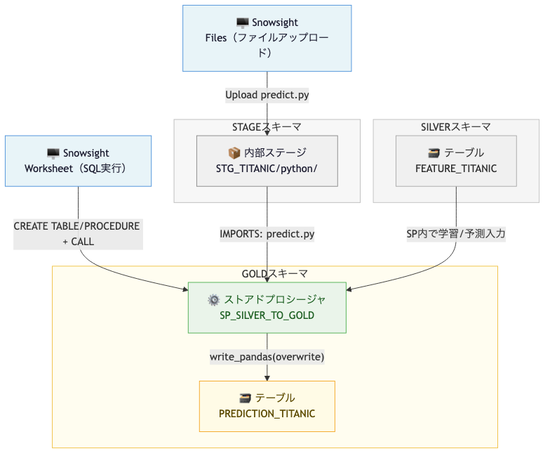

---

## 5-1. SQLによる操作

**005_Silver_to_Gold_import.sql - SQL概要**
|STEP|項目|概要|
|---|---|---|
|1|`PREDICTION_TITANIC`テーブルの作成|`FEATURE_TITANIC`テーブルのデータを加工して機械学習モデルの予測結果を格納するためのテーブルを`GOLD`レイヤーに作成します。|
|2|Stored Procedureの作成|外部ファイルとしてアップロードしたPythonコードを使用してStored Procedureを作成します。|
|3|Stored Procedureの実行|作成したStored Procedureを実行して、`PREDICTION_TITANIC`テーブルにデータをロードします。|


**実行後のデータベースエクスプローラの状態**
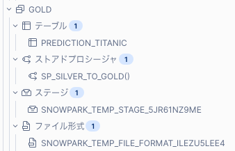

---

## 5-2. （参考）予測モデル概要 - predict.py

このハンズオンでは、`RandomForestClassifier` を使って生存予測を行います。  
モデル学習と予測は `predict.py`（Stored Procedure）内で実行されます。

|項目|内容|
|---|---|
|目的変数|`SURVIVED`（生存: 1 / 非生存: 0）|
|説明変数|`PCLASS`, `SEX_ENCODED`, `AGE`, `SIBSP`, `PARCH`, `FARE`, `EMBARKED_C`, `EMBARKED_Q`, `EMBARKED_S`|
|アルゴリズム|`RandomForestClassifier`（`n_estimators=100`, `random_state=42`）|
|評価|学習データを分割（`test_size=0.2`）しつつ、実行結果として精度を返却|
|出力先|`GOLD.PREDICTION_TITANIC`（予測ラベル、生存確率、正誤フラグを格納）|

---

## 6. クリーンアップ

**999_Cleanup.sql**を実行することで、このハンズオンで作成したデータベースやテーブル、ファイルなどを削除することができます。<br>ハンズオン終了後に実行して、環境をクリーンな状態に戻すことを推奨します。


---

<!-- _class: section-break -->

# おまけ<br>Snowflake CLIを使ったリモート実行


---

## Snowflake CLIとは

Snowflake CLIは、Snowsightで実施した手順をローカルから再現するためのコマンドラインツールです。  
このハンズオンでは、`snow sql` を使ってワークスペース内のSQLを順番に実行します。

<br>

<a class="link-card" href="https://docs.snowflake.com/ja/developer-guide/stored-procedure/stored-procedures-overview" target="_blank">
  <span class="link-card-icon">📄</span>
  <span>
    <div class="link-card-title">Snowflake - Snowflake CLI</div>
    <div class="link-card-url">https://docs.snowflake.com/ja/developer-guide/snowflake-cli/index</div>
  </span>
</a>

---


## Snowflake CLIのSetup

**1. 接続作成**
※ 次のページに入力項目を記載
```bash
snow connection add
```

**2. 接続設定ファイル**
- Mac: `/Users/<username>/.snowflake/connections.toml`
- Windows: `C:\Users\<username>\.snowflake\connections.toml`


**3. 接続確認**
```bash
snow connection list
snow connection test --connection <connection-name>
snow sql -q "select current_version();" --connection <connection-name>
```

--- 

## Snowflake CLIのSetup(続き)

**snow connection add　で追加する項目**

| 項目 | 説明 |
|---|---|
| `account` | アカウント識別子 |
| `user` | ログイン名 |
| `password` | ログイン時のパスワード |

**Snowsightからアカウント詳細を確認**
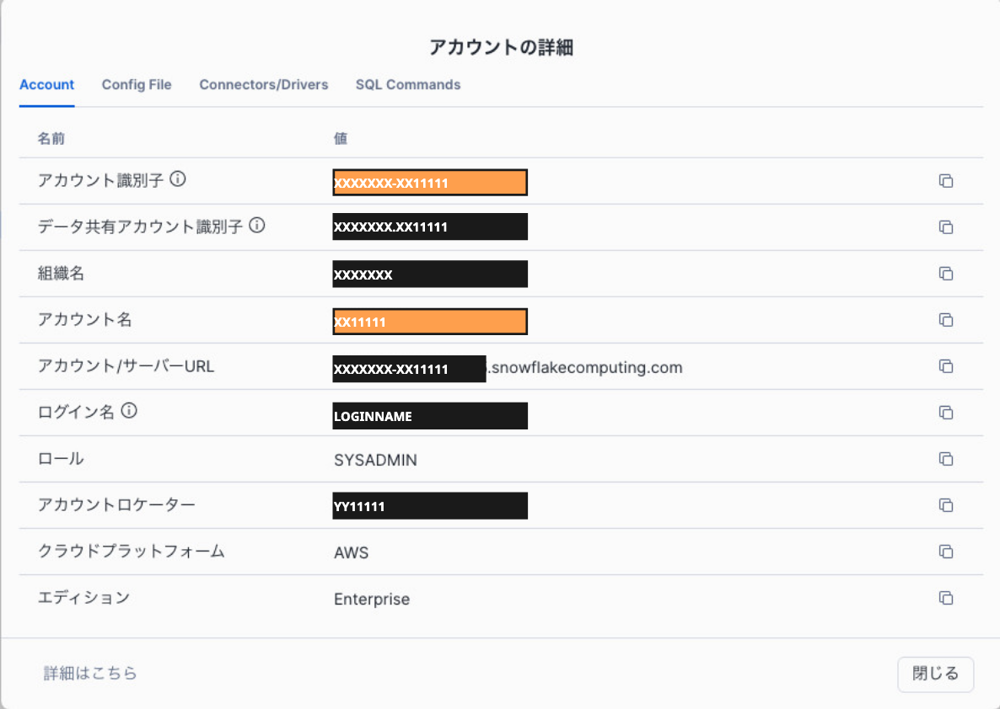


---

## Snowflake CLIのSetup(続き)

**4. 実行例**
```bash
# 1) 環境セットアップ
snow sql -f src/snowflake/workspace/001_Setup.sql --connection <connection-name>

# 2) STAGE/FILE FORMAT作成
snow sql -f src/snowflake/workspace/002_LoadStage.sql --connection <connection-name>

# 3) CSVアップロード
snow sql -q "PUT file://data/Titanic-Dataset.csv @TITANIC_DB.STAGE.STG_TITANIC/data/ OVERWRITE = TRUE AUTO_COMPRESS = FALSE;" --connection <connection-name>

# 4) BRONZEへロード
snow sql -f src/snowflake/workspace/003_Stage_to_Bronze.sql --connection <connection-name>

# 5) Pythonアップロード
snow sql -q "PUT file://src/snowflake/python/transform.py @TITANIC_DB.STAGE.STG_TITANIC/python/ OVERWRITE = TRUE AUTO_COMPRESS = FALSE;" --connection <connection-name>
snow sql -q "PUT file://src/snowflake/python/predict.py @TITANIC_DB.STAGE.STG_TITANIC/python/ OVERWRITE = TRUE AUTO_COMPRESS = FALSE;" --connection <connection-name>

# 6) SILVERへ変換
snow sql -f src/snowflake/workspace/004_Bronze_to_Silver_import.sql --connection <connection-name>

# 7) GOLDへ変換
snow sql -f src/snowflake/workspace/005_Silver_to_Gold_import.sql --connection <connection-name>
```

---

## Snowflake CLIのSetup(続き)

という、操作をまとめたscriptを用意しています。

- Mac : `scripts/run_all.sh`
- Windows : `scripts/run_all.ps1`

また、クリーンナップ用のscriptの用意しています。

- Mac : `scripts/run_cleanup.sh`
- Windows : `scripts/run_cleanup.ps1`

---


<!-- _class: section-break -->

# まとめ

---

## まとめ
- このハンズオンでは、Snowflakeの**Stored Procedure**を使って、SQLからPythonコードを実行し、`STAGE → BRONZE → SILVER → GOLD`の流れで<u>複雑なデータ変換</u>を実装する方法を学びました。
- Python Stored Procedureを利用し、SQLだけでは書きづらい前処理や機械学習推論をSnowflake上で実行できることを確認しました。
- おまけではSnowflake CLIを用いてローカルでもSQLを実行できることを体験しました。


--- 

## その他事項

**Ⅰ. 注意事項**
ハンズオンで作成したデータベース名は固定値になっています。もし同時に複数人でハンズオンを実施する場合は、データベース名が重複しないように、SQLファイル内のデータベース名を適宜変更してから実行するようにしてください。

<br><br>

**Ⅱ. データについて**
このProjectではKaggleのtitanicデータセットを利用しています。
- Dataset: `yasserh/titanic-dataset`
- License: `CC0: Public Domain (CC0-1.0)`
- URL: [Kaggle - yasserh/titanic-dataset](https://www.kaggle.com/datasets/yasserh/titanic-dataset)
- 注意: 規約はKaggleデータセットページの表示を優先する

---


<!-- _class: closing -->

# Thank you!!!

ご質問・フィードバックは以下までお願いします。

<div class="social-list">
  GitHub: <a href="https://github.com/fukushiki" target="_blank">@fukushiki</a><br>
  X: <a href="https://x.com/fuku4ki" target="_blank">@fuku4ki</a>
</div>

<div class="copyright">
  © 2026 fukushiki All rights reserved.
</div>
